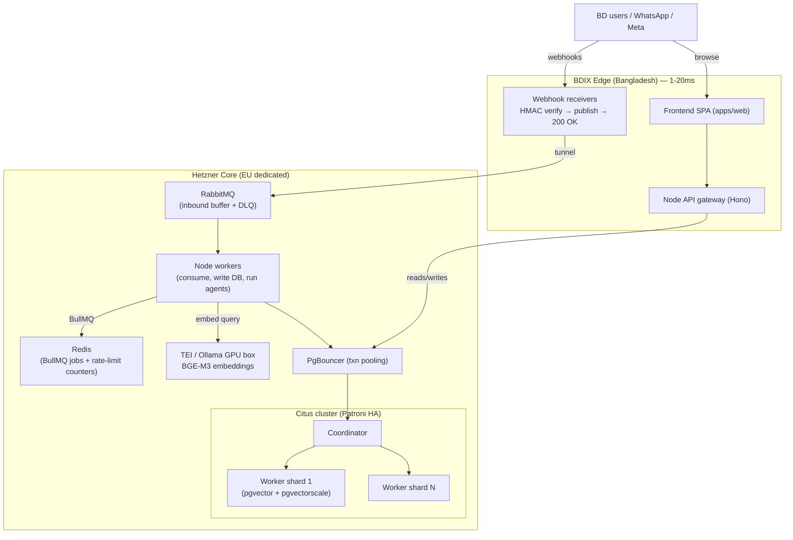

# Scaling Roadmap: 1 → 100,000 Tenants

> **Status:** Living architecture document. Blueprint only — nothing here is built yet.
> Each phase has a concrete customer-count trigger; do not build ahead of the trigger.
>
> **Source:** Distilled from the project's scaling research paper and mapped onto the
> actual codebase. Where the paper gives generic advice, this doc names the exact
> table, file, and current mechanism that changes.

---

## 1. Current State (grounded)

| Area | Current | File / table |
|------|---------|--------------|
| Web framework | Hono 4 (Node 22) | `apps/server/src/index.ts` |
| ORM / DB | Drizzle 0.45 + **PostgreSQL** (`pg.Pool`, max 10). PGlite in tests. | `apps/server/src/db/index.ts` |
| Migration status | SQLite → Postgres **in progress** (separate session). `db/raw.ts` is the `?`→`$n` compat shim. **`jobs/queue.ts` still uses the synchronous `sqlite.prepare()` API — not yet ported.** | `apps/server/src/db/raw.ts`, `apps/server/src/jobs/queue.ts` |
| Multi-tenancy | `tenant_id` on ~80 tables, all indexed. Resolved per request. **Already an ideal Citus distribution key.** | `schema.ts`, `schema-modules.ts`, `middleware/tenant.ts` |
| AI agents | Hermes + CEO. OpenAI / Anthropic / Gemini, tenant BYOK → plan → platform env. | `llm/registry.ts`, `services/hermes/agent.ts` |
| **RAG** | **None.** No embeddings, no vector column, no retrieval. | — |
| Knowledge corpus | `agentSouls` (business_profile, faqs, tone) + `soulSources` (raw website / FB / FAQ text) — **ingested but never embedded or retrieved.** | `schema.ts` (agentSouls, soulSources) |
| Background jobs | In-process durable queue on `job_queue` table, polled every 5s. Dedupe + delayed + 3-attempt backoff. No Redis/BullMQ/RabbitMQ. | `jobs/queue.ts`, `jobs/scheduler.ts` |
| Realtime | SSE only, tenant-scoped. Adequate — keep. | `realtime/sse.ts`, `realtime/emitter.ts` |
| Rate limiting | In-process sliding window, 29 msg/hr/number. **Process-local — breaks under horizontal scale.** | `lib/rate-limiter.ts` |
| Webhooks | WAHA / FB / Telegram / Woo. HMAC-verified, **synchronous** ingest + async `onInboundMessagePersisted` hook. | `routes/waha/webhook.ts`, `routes/webhooks/*`, `services/inbound-hooks.ts` |
| Deploy (**STALE**) | `Dockerfile` / `docker-compose.yml` / `litestream.yml` still build for SQLite + better-sqlite3 + litestream→R2. **Contradicts the Postgres migration — must be retired.** | `Dockerfile`, `docker-compose.yml`, `litestream.yml` |

---

## 2. Target Architecture (end state)

Hybrid: latency-sensitive light services at the **BDIX edge** (Bangladesh, ~1–20ms to
local users); heavy compute on **cheap EU dedicated hardware** (Hetzner). A secure
tunnel links them.



**Why hybrid:** dedicated EU hardware kills the cloud "noisy neighbour" problem and is
far cheaper per core/GB for the Citus + GPU workload; BDIX placement keeps the
interactive surface (dashboard, inbox, webhook ACK) fast for local users. Frankfurt
round-trip from Dhaka is ~120–170ms — unacceptable for the inbox, fine for async
processing behind the tunnel.

---

## 3. Gap Analysis

| Paper recommendation | Current code / mechanism | What's needed | Phase |
|----------------------|--------------------------|---------------|-------|
| pgvector + pgvectorscale RAG | No vector storage; `soulSources` text unused for retrieval | `embedding_chunks` table, ingest + retrieval pipeline, pgvector extension | P1 → P5 |
| Self-hosted Bengali embeddings (BGE-M3) | No embeddings at all | TEI/Ollama GPU service + embedding-provider abstraction | P1 |
| PgBouncer transaction pooling | `pg.Pool` max 10, direct connections | PgBouncer in front of Postgres, txn mode | P2 |
| Read replicas | Single primary | Logical-replication replica; route analytics/history reads | P2 |
| Shared rate-limit store | In-process counter (`lib/rate-limiter.ts`) | Redis-backed sliding window | P2 |
| RabbitMQ webhook decoupling | Synchronous webhook ingest | Receive→verify→publish→200 OK; workers consume | P3 |
| BullMQ background jobs | In-process `job_queue` polled 5s | Migrate `enqueueJob`/`processDueJobs` to BullMQ (Redis) + DLQ | P3 |
| Citus tenant sharding | `tenant_id` everywhere, single node | `create_distributed_table(t, 'tenant_id')` + colocation | P4 |
| Patroni + etcd + HAProxy HA | No auto-failover | HA cluster manager for coordinator + workers | P4 |
| DiskANN + halfvec at scale | (depends on P1 pgvector) | pgvectorscale index + `halfvec` to take vectors off-RAM | P5 |
| BullMQ social-media scheduling | CEO agent schedules ad hoc | Delayed/repeatable BullMQ jobs | P5 |
| Worker autoscaling | Fixed scheduler process | Scale Node workers on RabbitMQ queue depth | P6 |
| BDIX/EU hybrid infra | Single stale SQLite Docker stack | Edge/core split + tunnel + new compose | P6 (infra threads through all) |

No row is "TBD" — every current mechanism and its target are named.

---

## 4. RAG / Embedding Design (P1 — first buildable piece)

Fully specced so a later session can execute without re-research.

### Model & serving
- **BGE-M3** (BAAI) — 1024-dim, multilingual incl. strong Bengali, dense + sparse retrieval.
- Served by **HuggingFace Text Embeddings Inference (TEI)** (Rust, GPU) in production.
- **Ollama** as the dev/local fallback (no GPU needed for small corpora).
- A **7B-class model + BGE-M3 fit comfortably in 24GB VRAM** (RTX 3090/4090).

### Storage
New table `embedding_chunks`:

| Column | Type | Notes |
|--------|------|-------|
| `id` | uuid PK | |
| `tenant_id` | text | **indexed**; required (sharding + isolation) |
| `source_type` | text | `soul_source` \| `faq` \| `product` \| … |
| `source_id` | text | FK to origin row |
| `chunk_text` | text | the embedded chunk |
| `embedding` | `vector(1024)` | pgvector; migrate to `halfvec(1024)` at P5 |
| `created_at` | timestamptz | |

Index: `(tenant_id)` btree + an HNSW index on `embedding` (cosine). At P5, swap HNSW
for **pgvectorscale StreamingDiskANN** and `embedding` → `halfvec`.

### Ingest pipeline
- New module `apps/server/src/services/rag/`.
- New job kind `rag_index` registered in the existing `job_queue` (`registerJobHandler`).
- On `soulSources` insert/update → enqueue `rag_index` → chunk text → embed via TEI → upsert into `embedding_chunks`.

### Retrieval
- In `services/hermes/agent.ts`, **before** the LLM call: embed the inbound message,
  then a single SQL:
  ```sql
  SELECT chunk_text FROM embedding_chunks
  WHERE tenant_id = $1
  ORDER BY embedding <=> $2  -- cosine distance
  LIMIT $k;
  ```
- Inject top-k chunks into the system prompt (extend `system_prompt_cache` build).
- **Single SQL combines tenant filter + vector search** — this is exactly why pgvector
  beats a separate vector DB here: no cross-store sync, isolation is a `WHERE` clause.

### Provider abstraction
Mirror `llm/registry.ts`: an `embeddingRegistry` resolving TEI → Ollama → API
(OpenAI/Voyage/Cohere) so the backend is swappable without touching call sites.

### Ops notes
- Bump `maintenance_work_mem` to **8–16GB only during index build** (default 64MB makes
  large HNSW builds spill to disk and take days), then revert.
- `halfvec` (16-bit) halves vector storage/RAM with no meaningful recall loss.

---

## 5. Phased Roadmap

Each phase: trigger → build → files/tables → exit criteria.

### P1 — Foundation (1–100 tenants)
- **Build:** Finish SQLite→PG migration (incl. porting `jobs/queue.ts` off `sqlite.prepare`). Add `pgvector` extension. Ship RAG MVP (§4) on one GPU running TEI. Enforce `tenant_id` on every new table.
- **Touches:** `db/index.ts`, `jobs/queue.ts`, new `services/rag/`, `services/hermes/agent.ts`, new `embedding_chunks` migration.
- **Status:** RAG layer **scaffolded** — `embeddings/` provider abstraction (TEI/Ollama/fake) + `services/rag/` (lazy `ensureRagSchema`, chunk, index, retrieve) + tests shipped. Job registration + soul-ingest enqueue + `agent.ts` retrieval injection are documented one-liners deferred until the queue/agent migration lands. See **[docs/RAG.md](RAG.md)**.
- **Exit:** Agent answers from tenant's own `soulSources`; queue runs on Postgres.

### P2 — Optimization (100–500)
- **Build:** Logical-replication **read replica** (route dashboard analytics + message history reads to it). **PgBouncer** transaction-pooling in front of Postgres. Replace `lib/rate-limiter.ts` in-process counter with a **Redis** shared sliding window.
- **Touches:** `db/index.ts` (read/write split), `lib/rate-limiter.ts`, infra (PgBouncer, Redis, replica).
- **Exit:** Reads offloaded; rate limit correct across >1 process.

### P3 — Decoupling (500–1,000)
- **Build:** **RabbitMQ** in front of webhook receivers — handler does verify-HMAC → publish → `200 OK` in ms; **workers consume** and write the DB. Migrate `enqueueJob`/`processDueJobs` (`jobs/queue.ts`) to **BullMQ** (Redis) with a **DLQ**. Split the background worker into its own process from the API server.
- **Touches:** `routes/waha/webhook.ts`, `routes/webhooks/*`, `jobs/queue.ts` → BullMQ, `jobs/scheduler.ts`, new worker entrypoint.
- **Exit:** Webhook ACK <50ms under spike; failed events land in DLQ, replayable.

### P4 — Distributed shift (1,000–10,000)
- **Build:** Enable **Citus**. `create_distributed_table(..., 'tenant_id')` for the high-volume tables (`messages`, `contacts`, `fb_messages`, `embedding_chunks`, …) with **colocation** so per-tenant joins stay on one worker. Deploy **Patroni + etcd + HAProxy** for auto-failover of coordinator + workers.
- **Touches:** migration scripts (distribute tables), infra (Citus cluster, Patroni). No app query changes if `tenant_id` is always in the predicate (it is).
- **Exit:** Writes distributed across workers; primary failover <30s, zero manual steps.

### P5 — AI & data scaling (10,000–20,000)
- **Build:** **pgvectorscale StreamingDiskANN** + `embedding` → `halfvec` so billions of vectors live on fast NVMe, not RAM. **BullMQ delayed/repeatable jobs** for social-media scheduling. Store multi-agent context as **JSONB** on worker nodes.
- **Touches:** `embedding_chunks` migration (index + type), `services/rag/`, new social-scheduling jobs, agent context tables.
- **Exit:** Vector search sub-second at billion-scale off-RAM; scheduled posts fire on time.

### P6 — Enterprise scale (20,000–100,000+)
- **Build:** Add Citus **worker nodes** + tenant-shard **rebalance**. **Autoscale** Node workers on RabbitMQ queue depth. Multi-node **BDIX edge** + EU core with global routing.
- **Touches:** infra (Citus rebalance, worker autoscaler, edge nodes, tunnel).
- **Exit:** Linear capacity by adding workers; edge users <20ms; processing elastic with load.

---

## 6. Infra / Deploy Changes

- **Retire the SQLite stack:** remove better-sqlite3 build steps from `Dockerfile`, drop `litestream.yml` and the litestream/restic services in `docker-compose.yml`.
- **New compose services (introduced by phase):**
  - P1: Postgres image **with pgvector** (e.g. `pgvector/pgvector` or custom build), TEI/Ollama.
  - P2: Redis, PgBouncer, read replica.
  - P3: RabbitMQ, dedicated worker container.
  - P4: Citus coordinator + workers, Patroni, etcd, HAProxy.
- **Backups shift:** litestream→R2 replaced by **`pg_dump` / WAL-G** (or Citus-aware backup) to object storage.
- **Edge/core split (P6):** BDIX VPS runs frontend + gateway + webhook receivers; Hetzner runs DB/queues/GPU; connect over a secure tunnel (WireGuard/Tailscale).

---

## 7. Risks & Open Questions

- **GPU sourcing for TEI** — own hardware vs. rented GPU; 24GB VRAM target. Until then, P1 can run BGE-M3 on Ollama CPU for small corpora or fall back to an API provider via the abstraction.
- **BDIX↔EU tunnel** — latency, throughput, and security of the link carrying webhook payloads; encryption + auth mandatory.
- **Citus migration downtime** — distributing existing large tables is not free; plan a maintenance window or online rebalance at P4.
- **Cost curve** — model per-phase infra cost; dedicated EU hardware vs. managed services.
- **When self-hosted embeddings actually pay off** — API embeddings are fine and cheaper to operate at low volume; the crossover to self-hosted is volume-driven. Keep the provider abstraction so the switch is config, not code.
- **Partial migration hazard** — `jobs/queue.ts` still on the synchronous SQLite API; P1 must finish this before any Postgres-only feature depends on the queue.

---

## 8. References

- Citus — multi-tenant sharding & `create_distributed_table`: docs.citusdata.com
- Patroni 3.0 + Citus HA: citusdata.com/blog/2023/03/06/patroni-3-0-and-citus
- pgvector / pgvectorscale (StreamingDiskANN, halfvec): github.com/timescale/pgvectorscale
- BGE-M3 multilingual embeddings: BAAI General Embedding
- HuggingFace Text Embeddings Inference (TEI)
- PgBouncer transaction pooling
- RabbitMQ (inbound buffer + DLX) / BullMQ (Redis-backed jobs, delayed/repeatable)
- Webhook timeout best practices (verify→enqueue→200 OK pattern)
